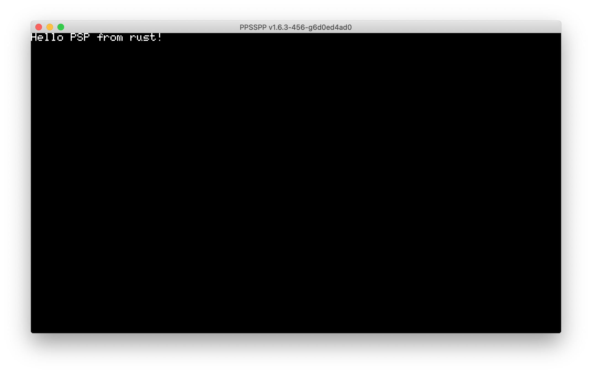

# rust-psp



A library for building full PSP modules, including both PRX plugins and regular
homebrew apps.

```rust
#![no_std]
#![no_main]

psp::module!("sample_module", 1, 1);

fn psp_main() {
    psp::dprintln!("Hello PSP from rust!");
}
```

See `examples` directory for sample programs.

## Installation / Usage

Currently, this crate depends on a patched `libcore`. This means it is not
easy to build or use. The patch is available [here], if you wish to apply it
yourself. This patch has already been merged upstream into `stdarch`, however it
has not been merged into the rust compiler as of when this README was written.

Work is underway in order to add the PSP as a first class Rust target here:

https://github.com/rust-lang/rust/pull/72062
https://github.com/pspdev/pspsdk/pull/34

Once these two PRs land, it should be very easy to build the examples, and
instructions will be posted.

[here]: https://github.com/rust-lang/stdarch/pull/854/files

## Features / Roadmap

- [x] `core` support
- [x] PSP system library support
- [x] `alloc` support
- [x] `panic = "unwind"` support
- [ ] Figure out a strategy for the VFPU
- [ ] Migrate to LLVM-based linker
- [ ] Rewrite `psp-prxgen` in rust?

## Known Bugs

This crate **breaks** on debug builds. Likely due to the ABI mapper
implementation. This should be fixable. For now build with `--release`.

## `error[E0460]: found possibly newer version of crate ...`

If you get an error like this:

```
error[E0460]: found possibly newer version of crate `panic_unwind` which `psp` depends on
 --> src/main.rs:4:5
  |
4 | use psp::dprintln;
  |     ^^^
  |
  = note: perhaps that crate needs to be recompiled?
```

Simply clean your target directory and it will be fixed:

```sh
$ cargo clean
```
