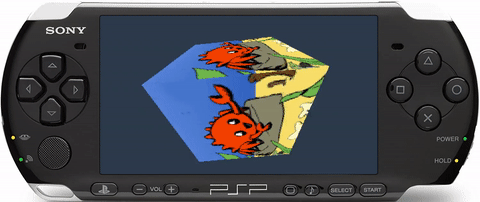

<h1 align="center">rust-psp</h1>

<p align="center"></p>
<p class="" align="center">
    <a href="https://ci.mijalkovic.ca/teams/rust-psp/pipelines/rust-psp/jobs/run-tests-for-master/">
        
    </a>
    <a href="https://crates.io/crates/psp">
        
    </a>
    <a href="https://docs.rs/psp">
        
    </a>
</p>
<p align="center">
    A library for building full PSP modules, including both PRX plugins and regular
    homebrew apps.
</p>

```rust
#![no_std]
#![no_main]

psp::module!("sample_module", 1, 1);

fn psp_main() {
    psp::enable_home_button();
    psp::dprintln!("Hello PSP from rust!");
}
```

See `examples` directory for sample programs.

## What about PSPSDK?

This project is a completely new SDK, with no dependency on the original C/C++
PSPSDK. It aims to be a **complete** replacement, with more efficient
implementations of graphics functions, and the addition of missing libraries.

## Features / Roadmap

- [x] `core` support
- [x] PSP system library support
- [x] `alloc` support
- [x] `panic = "unwind"` support
- [x] Macro-based VFPU assembler
- [x] Full 3D graphics support (faster than PSPSDK in some cases!)
- [x] No dependency on PSPSDK / PSPToolchain
- [x] Reach full parity with user mode support in PSPSDK
- [x] Port definitions to `libc` crate
- [ ] Add support for creating kernel mode modules
- [ ] Add `std` support
- [ ] Automatically sign EBOOT.PBP files to run on unmodified PSPs
- [ ] Implement / reverse undiscovered libraries

## Dependencies

To compile for the PSP, you will need a Rust **nightly** version equal to or
later than `2025-03-19` and the `rust-src` component. Please install Rust using
https://rustup.rs/

Use the following if you are new to Rust. (Feel free to set an override manually
per-project instead).

```sh
$ rustup default nightly && rustup component add rust-src
```

You also need `cargo-psp` installed:

```sh
$ cargo install cargo-psp
```

## Running Examples

Enter one of the example directories, `examples/hello-world` for instance, and
run `cargo psp`.

This will create an `EBOOT.PBP` file under `target/mipsel-sony-psp/debug/`

Assuming you have a PSP with custom firmware installed, you can simply copy this
file into a new directory under `PSP/GAME` on your memory stick, and it will
show up in your XMB menu.

```
.
└── PSP
    └── GAME
        └── hello-world
            └── EBOOT.PBP
```

If you do not have a PSP, we recommend using the [PPSSPP emulator](http://ppsspp.org).
Note that graphics code is very sensitive so if you're writing graphics code we
recommend developing on real hardware. PPSSPP is more relaxed in some aspects.

### Advanced usage: `PRXEncrypter`

If you don't have a PSP with CFW installed, you can manually sign the PRX using
`PRXEncrypter`, and then re-package it using `pack-pbp`.

### Advanced usage: PSPLink

If you have the PSPSDK installed and have built a working copy PSPLink manually,
you can also use `psplink` and `pspsh` to run the `.prx` under
`target/mipsel-sony-psp/debug/` if you prefer. Refer to the installation and
usage guides for those programs.

### Debugging

Using the latest version of psplink and psp-gdb from the [pspdev github organization](https://github.com/pspdev) (`psplinkusb v3.1.0 and GNU gdb (GDB) 11.0.50.20210718-git` or later), Rust types are fully supported, providing a rich debugging experience. Enable debug symbols in your release binaries

`Cargo.toml`
```toml
[profile.release]
debug = true
```
and follow the instructions in part 6 of [the PSPlink manual](https://usermanual.wiki/Document/psplinkmanual.1365336729/)

## Usage

To use the `psp` crate in your own Rust programs, add it to `Cargo.toml` like
any other dependency:

```toml
[dependencies]
psp = "x.y.z"
```

In your `main.rs` file, you need to setup a basic skeleton like so:

```rust
#![no_std]
#![no_main]

// Create a module named "sample_module" with version 1.0
psp::module!("sample_module", 1, 0);

fn psp_main() {
    psp::enable_home_button();
    psp::dprintln!("Hello PSP from rust!");
}
```

Now you can simply run `cargo psp` to build your `EBOOT.PBP` file. You can also
invoke `cargo psp --release` to create a release build.

If you would like to customize your EBOOT with e.g. an icon or new title, you
can create a `Psp.toml` file in the root of your project. Note that all keys are
optional:

```toml
title = "XMB title"
xmb_icon_png = "path/to/24bit_144x80_image.png"
xmb_background_png = "path/to/24bit_480x272_background.png"
xmb_music_at3 = "path/to/ATRAC3_audio.at3"
```

More options can be found in the schema defintion [here](/cargo-psp/src/main.rs#L18-L100).

## `error[E0460]: found possibly newer version of crate ...`

If you get an error like this:

```
error[E0460]: found possibly newer version of crate `panic_unwind` which `psp` depends on
 --> src/main.rs:4:5
  |
4 | use psp::dprintln;
  |     ^^^
  |
  = note: perhaps that crate needs to be recompiled?
```

Simply clean your target directory and it will be fixed:

```sh
$ cargo clean
```
